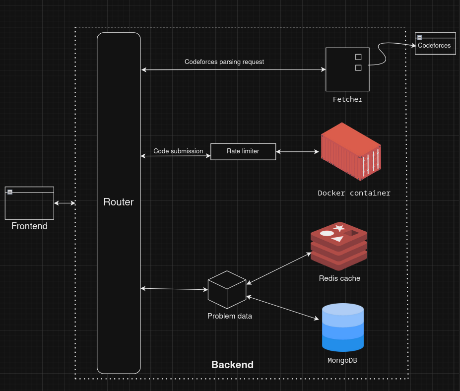

# 🎉 Codespaces

Hey there! I was curious about how Codeforces worked, so I decided to create my own version! Welcome to **Codespaces**—your friendly problem solving playground! 🧑‍💻✨

## ✨ Features

- **🔍 Codeforces Problem Scraping**: Users can create their own problem or just enter a Codeforces problem link and watch the magic happen! The problem statement and test cases are automatically parsed and saved to Codespaces. 🌟

- **✏️ Create Your Own Problems**: Feeling creative? You can also create and manage your own coding problems! 🎨

- **🚀 Code Evaluation**: Evaluate code submissions in a snap!

- **👩‍💻👨‍💻 Collaborative Coding**: Team up with your friends and solve problems together in real-time with up to 10 users. 

- **🎤 Group Voice Chat**: Integrated group voice chat for seamless collaboration using WebRTC. Chat away while you code! 🗣️🎧

- **📦 Problem Packages**: Easily store and manage problem packages.

- **🧮🖼️ Math and Image Rendering**: Supports rendering math equations and images (or any media) in problem statements.

- **⚡ Caching**: Lightning-fast caching for problem statements and packages using Redis.

## 🎬 Demo

Check out the demo [here](https://www.youtube.com/watch?v=9eF_-2vc_9s). 🍿

## 🏗️ System Architecture



Here's a high-level architecture of our cute little system. 🥰

## 📝 Submission Handling

- Every new submission triggers a shiny new Docker container (Alpine Linux). 🐳
- The container:
  - Compiles and runs the program.
  - Pulls the test data from the database if it’s not cached.
  - Compares the program output to the expected output.
  - Sends a verdict (yay or nay!).
- Programs have a 2-second time limit; if they don't finish in time, they get a TLE (Time Limit Exceeded) verdict. ⏰

## 🔧 Implementation Details

- **🎤 Group Voice Chat**: Implemented using WebRTC to reduce server load. Chat with your whole group while you code!

- **🐳 Docker API**: Used to spawn containers on the fly for code evaluation.

- **🤝 Collaborative Features**: Utilized WebSockets (Socket.IO) for real-time collaboration.

- **⛏ Web scraping**: Used BeautifulSoup with a custom scraper to scrape problems from codeforces.

- **📦 Problem Packages**: Stored in MongoDB for easy management.
  - Includes:
    - Problem Statements (Interpreted)
    - Sample test data
    - Main test data (for evaluating submissions)
    - Expected outputs for the main tests

- **⚡ Redis Caching**: Cached problem packages and test data to limit database hits.

- **🧮 Math Rendering**: Used KaTeX for rendering math equations.

- **🚫 Rate Limiting**: Added to each compilation API call to prevent abuse.

## 🌐 Supported Languages

- Only supports C++ for now. 🖋️

## 🚀 Usage

To use this project, follow these steps:

1. Clone the repository:
   ```sh
   git clone https://github.com/nubskr/codespace.git
   cd codespace
   ```
2. Install dependencies:
   ```sh
   npm install
   ```
3. Start the server:
   ```sh
   npm start
   ```
4. Open the application in your browser.

### Prerequisites

- You need Docker and Redis installed in the backend to use the submission functionality.
- The `./Docker` directory contains the Docker image I made to evaluate the submissions.
