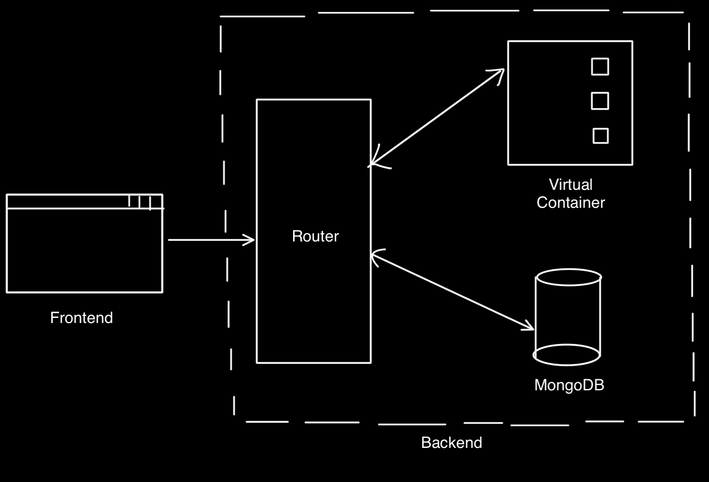

# Codespaces

I was curious about how Codeforces worked, so I made my own version :)

## Features

- **Code Evaluation**: Evaluate code submissions.
- **Collaborative Coding**: Support for multiple users to code together.
- **Voice Chat**: Integrated voice chat for collaboration.
- **Problem Packages**: Store and manage problem packages.
- **Math and Image Rendering**: Support for rendering math equations and images(or any media for that matter) in problem statements.

### You can check the demo [here](https://www.youtube.com/watch?v=9eF_-2vc_9s)!

## System Architecture

high-level architecture of the system.

## Submission Handling

- Every new submission triggers the launch of a new Docker container (Alpine Linux).
- The container compiles and runs the program, compares the output to the expected output, and sends a verdict.
- There is a 2-second time limit for each program; if it doesn't complete output by then, it gets terminated, and a TLE (Time Limit Exceeded) verdict is sent.

## Implementation Details

- **Voice Chat**: Implemented using WebRTC to reduce load on the server.
- **Docker API**: Used Docker API to spawn containers on the fly for code evaluation.
- **Collaborative Features**: Utilized WebSockets (Socket.IO) for real-time collaboration.
- **Problem Packages**: Stored in MongoDB for easy management.
    - Includes:
        - Problem Statements (Interpreted)
        - Sample test data
        - Main test data (to evaluate submissions)
        - Expected outputs for the main tests
- **Math Rendering**: Used KaTeX for rendering math equations.
- **Rate Limiting**: Added to each compilation API call to prevent abuse.

Only supports C++ as of now

## Usage

To use this project, follow these steps:

1. Clone the repository.
2. Install dependencies.
3. Start the server.
4. Open the application in your browser.
(Note: You need docker installed in the backend to use the submission functionality)

./Docker contains the docker image I made to evaluate the submissions