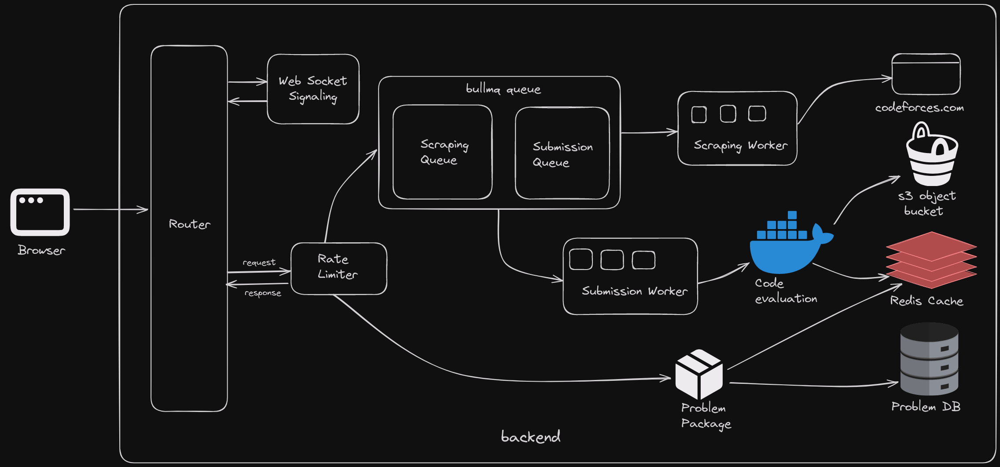

# 🎉 Codespaces

I was curious about how Codeforces worked, so  created my own version! Welcome to **Codespaces**—your social problem solving playground! 🧑‍💻✨


## ✨ Features

- **✏️ Create Your Own Problems**: Feeling creative? You can also create and manage your own coding problems! 🎨

- **🔍 Codeforces Problem Scraping**: Users can just enter a Codeforces problem link and watch the magic happen! The problem statement and test cases are automatically parsed and shared across all the users int the room. 🌟

- **🚀 Code Evaluation**: Evaluate codes submissions on the fly in a safe and secure sandboxed environment!

- **👩👨‍💻 Collaborative Coding**: Team up with your friends and solve problems together in real-time with up to 10 users. 

- **🎤 Group Voice Chat**: Integrated group voice chat for seamless collaboration using WebRTC. 

- **📦 Problem Packages**: Easily store and manage problem packages.

- **🧮🖼️ Math and Image Rendering**: Supports rendering math equations and images (or any media) in problem statements.

- **⚡ Caching**: Lightning-fast caching for problem statements and packages using Redis.

Can be used to host contests completely locally(for the most part)

## 🎬 Demo

Check out the demo [here](https://youtu.be/FdmE1Rnjy0o). 🍿

Hosting is down at the moment cause I lost access to my EC2 instance :(

## 🏗️ System Architecture



Here's a high-level architecture of our cute (not so)little monolithic system. 🥰

## 📝 Submission Handling

- Backend pulls the test data from database if its not cached

- Every new submission triggers a new Docker container (Alpine Linux).

- The container:
   - Compiles and runs the code in a sandbox in a secure way
   - Sends a verdict (AC/WA/CE/TLE/RTE).
   - Programs have a 2-second time limit and 256mb memory limit; if they don't finish in time, they get a TLE (Time Limit Exceeded) verdict. ⏰
   - Alongside the time and memory limit inside the container, the container has no access to the internet and has a limit of atmost 100 processes (to protect against fork bombs)

## Container architecture


This is what's inside the container 

### High level overview of what happens in each container:

- Compile the code and put it in a sandboxed environment with the input data.

- Change the password for the root user to something (truly)random so that untrusted code can't access the root userspace.

- Lock down the enviroment by setting permissions such that the code can't access anything outside of it,the code only has access to the input file.

- We run the code with a time limit of 2 seconds.

- After and if the code execution is complete, the generated output is then sent out to the root user for verification, if something goes wrong with the execution, then the sandbox gets terminated instantly and root user returns the verdict.

- If the code is executed successfully, the root user sends out the verdict by comparing the program output and expected output

Check [this](./Docker/doshit.sh) for implementation

### Note:
 
You are welcome and encouraged to try to hack this system as it would help me improve upon it in the next iteration and it wouldn't have reached this stage if people hadn't exploited it in the past.

If you find any bugs/vulnerabilites please open an issue and let me know as it's quite unpredictable what people would do to a system when they get their hands on it,especially when they can run codes on it.

### Wait a second, why did you make this again ?

idk, why do **you** do things ?, I like it, its just curiosity, I have no endgoal with this, I just like things to be as elegant and as fast as I can make them and this give me a way try novel things.

## 🔧 Implementation Details

- **🎤 Group Voice Chat**: Implemented using WebRTC to reduce server load. Chat with your whole group while you code!

- **🐳 Docker API**: Used to spawn containers on the fly for code evaluation.

- **🤝 Collaborative Features**: Utilized WebSockets (Socket.IO) for real-time collaboration.

- **⛏ Web scraping**: Used BeautifulSoup with a custom scraper to scrape problems from codeforces.

- **🏖️ Sandboxing**: Implemented sandboxing inside the docker container by setting up non privileged users to prevent untrusted codes from accessing the root userspace.

- **📦 Problem Packages**: Stored in MongoDB for easy management.
  - Includes:
    - Problem Statements (Interpreted)
    - Sample test data
    - Main test data (for evaluating submissions)
    - Expected outputs for the main tests

- **⚡ Redis Caching**: Cached problem packages and test data to limit database hits.

- **🧮 Math Rendering**: Used KaTeX for rendering math equations.

- **🚫 Rate Limiting**: Added to each compilation API call to prevent abuse.

## 🌐 Supported Languages

- Only supports C++ for now. 🖋️

## Current objectives

- Making submission system more scalable and efficient with better auto scaling(thinking about making this thing its own microservice, would take more time but would be very kawaii) 

- Making the system multi-node from one node, I'll also introduce a new architecture which 
ofc I won't be renting a cluster or whatever(I'm broke), instead let's try the hacky way, since ec2 instances are available in free tier, I'll just use those as nodes, and kubernetes would just scale shit up and down as needed, nice

- Fix a security issue which got introduced in the last update(ignorant of me to think that compiling untrusted code is safe)


## 🚀 Usage

To use this project, follow these steps:
(Ensure that Redis and Docker are installed before following these steps)

1. Clone the repository:
   ```sh
   git clone https://github.com/nubskr/codespace.git
   cd codespace
   ```

2. Install dependencies:
   ```sh
   npm install
   ```
3. Pull Container images and config docker and setup environment variables
   ```sh
   sudo ./setup.sh

   cd ./server
   vim .env

   MONGODB_URI=''
   AWS_ACCESS_KEY_ID=''
   AWS_SECRET_ACCESS_KEY=''
   AWS_REGION=''
   S3_BUCKET_NAME=''
   CONCURRENT_SCRAPING_WORKERS=''
   CONCURRENT_SUBMISSION_WORKERS=''
   ```
3. Start the servers:
   ```sh
   npm start
   cd ..
   cd ./frontend
   npm start
   ```
4. Open the application in your browser.

### Prerequisites

- You need Docker and Redis installed in the backend to use the submission functionality.
- The `./Docker` directory contains the Docker image I made to evaluate the submissions.
